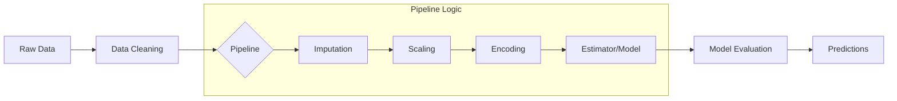

<div align="center">

# Machine Learning Pipeline Architect

### "Bridging the Gap Between Raw Data and Scalable Intelligence"

[](https://www.python.org/downloads/)
[]()
[](https://opensource.org/licenses/MIT)
[](https://scikit-learn.org/)
[]()

</div>

---

## 📋 Table of Contents
1. [Introduction](#-introduction)
2. [Key Features](#-key-features)
3. [Tech Stack](#-tech-stack)
4. [Architecture & Pipeline Flow](#-architecture--pipeline-flow)
5. [Getting Started](#-getting-started)
    - [Prerequisites](#prerequisites)
    - [Installation](#installation)
    - [Configuration](#configuration)
6. [Usage Guide](#-usage-guide)
7. [Folder Structure](#-folder-structure)
8. [Roadmap](#-roadmap)
9. [Contributing](#-contributing)
10. [License](#-license)
11. [Contact & Acknowledgements](#-contact--acknowledgements)

---

## 📖 Introduction

In the evolving landscape of Data Science, the transition from experimental code to production-ready software is often marred by "spaghetti code" and manual data transformation steps. This project, **Machine Learning Pipeline Architect**, serves as a foundational blueprint for building robust, reproducible, and scalable machine learning workflows.

The primary objective of this repository is to demonstrate the power of the **Scikit-Learn Pipeline API**. By encapsulating data preprocessing, feature engineering, and model training into a single, cohesive object, we eliminate common pitfalls such as **Data Leakage** (where information from the test set "leaks" into the training process) and ensure that the transformation logic applied to training data is identically applied to new, unseen data.

Whether you are a beginner looking to understand the "MLOps" mindset or a seasoned developer seeking a clean template for your next model, this project showcases how to move away from fragmented scripts and toward a unified, automated pipeline.

---

## ✨ Key Features

*   **🧪 Automated Preprocessing**: Seamlessly handles missing values using sophisticated imputation strategies (Mean, Median, or Mode) and performs feature scaling without manual intervention.
*   **📂 Categorical Encoding**: Implements automated One-Hot Encoding and Label Encoding for categorical variables, ensuring the model can interpret non-numeric data types effectively.
*   **🛡️ Data Leakage Prevention**: By utilizing `Pipeline` objects, the project ensures that transformations are fitted only on the training subset, maintaining the integrity of the evaluation process.
*   **⚡ Integrated Feature Engineering**: Demonstrates how to create custom transformers that can be plugged directly into the pipeline for domain-specific data manipulation.
*   **📊 Performance Analytics**: Includes comprehensive evaluation metrics (Accuracy, Precision, Recall, F1-Score) and visualization tools to interpret model results.
*   **🔄 Scalability**: The architecture is designed to be "plug-and-play." You can easily swap out the estimator (e.g., switching from Random Forest to XGBoost) with minimal code changes.
*   **📓 Interactive Documentation**: The core logic is housed within a well-commented Jupyter Notebook (`With_pipeline.ipynb`), providing a narrative-driven approach to the code.

---

## 🛠️ Tech Stack

This project leverages a curated selection of industry-standard libraries to ensure performance and reliability.

| Technology | Role | Rationale |
| :--- | :--- | :--- |
| **Python 3.8+** | Core Language | The de facto standard for data science due to its vast ecosystem. |
| **Scikit-Learn** | ML Framework | Chosen for its robust `Pipeline` and `ColumnTransformer` modules which are essential for structured workflows. |
| **Pandas** | Data Manipulation | Offers high-performance, easy-to-use data structures for data analysis. |
| **NumPy** | Numerical Computing | Provides the foundation for mathematical operations and array handling. |
| **Matplotlib / Seaborn** | Visualization | Used to generate insightful plots for data distribution and model error analysis. |
| **Jupyter** | Development Environment | Facilitates rapid prototyping and visual storytelling of the data science process. |

---

## 🏗️ Architecture & Pipeline Flow

The project follows a linear, modular architecture that mimics real-world production systems.



1.  **Ingestion**: Loading data from various sources (CSV, SQL, etc.).
2.  **Preprocessing**: Handling Nulls and outliers.
3.  **Transformation**: Applying `StandardScaler` to numerical columns and `OneHotEncoder` to categorical ones via `ColumnTransformer`.
4.  **Modeling**: Fitting the pipeline to the training data.
5.  **Serialization**: (Planned) Saving the entire pipeline as a `.pkl` or `.joblib` file for deployment.

---

## 🚀 Getting Started

### Prerequisites

Before you begin, ensure you have the following installed:
*   Python 3.8 or higher.
*   `pip` (Python package manager).
*   Virtual environment tool (optional but highly recommended).

### Installation

1.  **Clone the repository:**
    ```bash
    git clone https://github.com/yourusername/machine-learning-project.git
    cd machine-learning-project
    ```

2.  **Create a virtual environment:**
    ```bash
    # Windows
    python -m venv venv
    .\venv\Scripts\activate

    # macOS/Linux
    python3 -m venv venv
    source venv/bin/activate
    ```

3.  **Install dependencies:**
    Since this is a notebook-centric project, ensure you install the core DS stack:
    ```bash
    pip install pandas numpy scikit-learn matplotlib seaborn jupyter
    ```

### Configuration

No external API keys or complex environment variables are required for the base version of this project. If you plan to use a specific dataset from a private source, you can create a `.env` file:
```env
DATASET_PATH=./data/raw_data.csv
MODEL_OUTPUT_PATH=./models/
```

---

## 📖 Usage Guide

The primary entry point for this project is the `With_pipeline.ipynb` notebook. 

1.  **Launch Jupyter Notebook:**
    ```bash
    jupyter notebook
    ```

2.  **Open the file:** 
    Navigate to `With_pipeline.ipynb` in the browser interface.

3.  **Execution Flow:**
    *   **Section 1: Data Exploration**: View head, info, and summary statistics.
    *   **Section 2: Pipeline Definition**: This is the heart of the project. Look for the `Pipeline([...])` code block.
    *   **Section 3: Model Training**: Executing `pipeline.fit(X_train, y_train)`.
    *   **Section 4: Evaluation**: Visualizing the confusion matrix and classification report.

### Code Snippet Example:
```python
from sklearn.pipeline import Pipeline
from sklearn.impute import SimpleImputer
from sklearn.preprocessing import StandardScaler
from sklearn.ensemble import RandomForestClassifier

# Defining the pipeline
pipe = Pipeline([
    ('imputer', SimpleImputer(strategy='median')),
    ('scaler', StandardScaler()),
    ('classifier', RandomForestClassifier())
])

# Training and Predicting in one step
pipe.fit(X_train, y_train)
predictions = pipe.predict(X_test)
```

---

## 📂 Folder Structure

```text
machine-learning-project/
├── .github/                 # GitHub actions and workflows (optional)
├── data/                    # Local datasets (ignored by git if large)
│   └── sample_data.csv
├── models/                  # Saved .pkl or .joblib models
├── notebooks/               # Experimental notebooks
│   └── With_pipeline.ipynb  # Main pipeline demonstration
├── src/                     # Source code for modular scripts (planned)
│   ├── __init__.py
│   ├── preprocess.py
│   └── train.py
├── .gitignore               # Files to ignore (venv, .pyc, etc.)
├── README.md                # Project documentation
└── requirements.txt         # List of dependencies
```

---

## 🗺️ Roadmap

- [ ] **Phase 1**: Implement basic Scikit-Learn Pipeline. (Current)
- [ ] **Phase 2**: Add Hyperparameter Tuning using `GridSearchCV` directly on the pipeline.
- [ ] **Phase 3**: Integrate `MLFlow` for experiment tracking and logging.
- [ ] **Phase 4**: Create a Flask or FastAPI wrapper to serve the pipeline as a REST API.
- [ ] **Phase 5**: Containerize the application using Docker for cloud deployment.

---

## 🤝 Contributing

Contributions are what make the open-source community such an amazing place to learn, inspire, and create. Any contributions you make are **greatly appreciated**.

1. Fork the Project.
2. Create your Feature Branch (`git checkout -b feature/AmazingFeature`).
3. Commit your Changes (`git commit -m 'Add some AmazingFeature'`).
4. Push to the Branch (`git push origin feature/AmazingFeature`).
5. Open a Pull Request.

---

## 📜 License

Distributed under the **MIT License**. See `LICENSE` for more information. This means you can use, modify, and distribute this code for both personal and commercial projects.

---

## ✉️ Contact & Acknowledgements

**Project Author** - Adarsh Dubey - [@adarshdubey_007](https://twitter.com/adarshdubey_007)

**Project Link:** [https://github.com/yourusername/machine-learning-project](https://github.com/adarsh-dubey-gthb/machine-learning-project)

### Acknowledgements
*   [Scikit-Learn Documentation](https://scikit-learn.org/stable/modules/compose.html) for the excellent Pipeline guide.
*   [Kaggle](https://www.kaggle.com/) for providing datasets that inspired the pipeline logic.
*   [Shields.io](https://shields.io/) for the badges.

---
<p align="center">
  <i>"Clean code is not written by accident; it is the result of disciplined engineering."</i>
</p>
